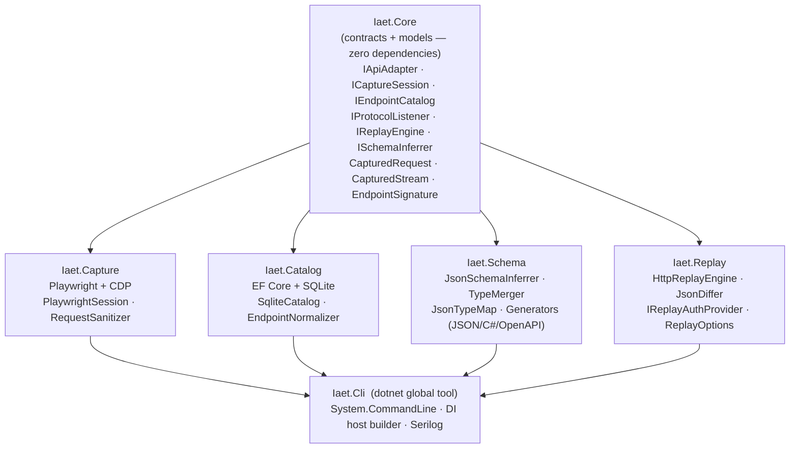

# IAET — Internal API Extraction Toolkit

IAET is a general-purpose toolkit for discovering, capturing, analyzing, and documenting undocumented browser-based internal APIs from any web application. It intercepts HTTP traffic via the Chrome DevTools Protocol while you interact with a target app, normalizes and deduplicates the observed endpoints, and persists them to a local SQLite catalog for downstream analysis. Intended for educational and security research purposes only.

---

## Quick Start

**Install the CLI tool:**
```bash
dotnet tool install -g iaet
```

**Start a capture session:**
```bash
iaet capture start --target "App Name" --url https://example.com --session my-session
```

**Browse captured data:**
```bash
iaet catalog sessions
iaet catalog endpoints --session-id <id>
```

**Infer schemas from response bodies:**
```bash
# Print JSON Schema, C# record, and OpenAPI fragment for an endpoint
iaet schema infer --session-id <guid> --endpoint "GET /api/users"

# Print only one format
iaet schema show --session-id <guid> --endpoint "GET /api/users" --format json
iaet schema show --session-id <guid> --endpoint "GET /api/users" --format csharp
iaet schema show --session-id <guid> --endpoint "GET /api/users" --format openapi
```

**Replay captured requests:**
```bash
# Replay a single request and show diffs vs original response
iaet replay run --request-id <guid>

# Dry-run: show what would be replayed without sending HTTP
iaet replay run --request-id <guid> --dry-run

# Replay one representative request per unique endpoint in a session
iaet replay batch --session-id <guid>
iaet replay batch --session-id <guid> --dry-run
```

**Capture with stream monitoring:**
```bash
# Stream capture is enabled by default
iaet capture start --target "App Name" --url https://example.com --session my-session

# Also capture payload samples (up to 1000 frames per connection)
iaet capture start --target "App Name" --url https://example.com --session my-session \
  --capture-samples --capture-frames 500

# Disable stream capture
iaet capture start --target "App Name" --url https://example.com --session my-session \
  --capture-streams false
```

**Inspect captured streams:**
```bash
# List all streams for a session
iaet streams list --session-id <guid>

# Show full details for a specific stream
iaet streams show --stream-id <guid>

# Show frame history (requires --capture-samples during capture)
iaet streams frames --stream-id <guid>
```

---

## Features

- Playwright-based browser capture via Chrome DevTools Protocol
- SQLite endpoint catalog with persistent storage
- Automatic endpoint deduplication and observation counting
- Header sanitization (Authorization, Cookie, CSRF tokens redacted)
- Data stream capture — WebSocket, SSE, WebRTC, HLS/DASH, gRPC-Web with frame history
- **Schema inference** — JSON Schema (draft-07), C# records, and OpenAPI 3.1 fragments from captured bodies, with nullable support and type-conflict warnings
- **HTTP replay** — field-level JSON diff, pluggable auth provider, rate limiting (10 req/min / 100 req/day), Polly retry + circuit breaker, dry-run mode
- Semi-autonomous crawler *(coming)*
- Export to OpenAPI / Postman / HAR *(coming)*
- Local Swagger-like API explorer *(coming)*
- Chrome DevTools extension *(coming)*
- Background capture extension *(coming)*

---

## Architecture



**Planned assemblies** (all depend on `Iaet.Core`):

- `Iaet.Crawler` — Semi-autonomous browser crawler
- `Iaet.Export` — OpenAPI / Postman / HAR export
- `Iaet.Explorer` — Local Swagger-like web explorer

---

## CLI Reference

```
iaet
├── capture
│   └── start  --target <name>  --url <url>  --session <name>
│              [--profile <name>]  [--headless]
│              [--capture-streams]  [--capture-samples]
│              [--capture-duration <seconds>]  [--capture-frames <n>]
├── catalog
│   ├── sessions
│   └── endpoints  --session-id <guid>
├── streams
│   ├── list    --session-id <guid>
│   ├── show    --stream-id <guid>
│   └── frames  --stream-id <guid>
├── schema
│   ├── infer  --session-id <guid>  --endpoint <signature>
│   └── show   --session-id <guid>  --endpoint <signature>  --format <json|csharp|openapi>
├── replay
│   ├── run    --request-id <guid>  [--dry-run]
│   └── batch  --session-id <guid>  [--dry-run]
│
│  (planned)
├── export     -- format (openapi|postman|har)  --session-id <guid>
├── explore    — launch local API explorer
├── crawl      — semi-autonomous capture crawler
├── import     — import .iaet.json capture files
└── investigate — assisted API discovery workflow
```

---

## Writing Adapters

`IApiAdapter` lets consumer projects attach target-specific logic to the generic capture pipeline. Implement two members:

- `CanHandle(CapturedRequest)` — return `true` if this adapter recognizes the request (e.g., by host or path prefix).
- `Describe(CapturedRequest)` — return an `EndpointDescriptor` enriched with operation name, parameter metadata, or authentication type gleaned from domain knowledge of that target.

Register adapters in DI alongside the core services. The catalog will call `Describe` when a matching adapter is present, storing the richer descriptor alongside the raw request.

---

## Data Stream Support

`CapturedStream` is the domain model for non-HTTP data channels observed during a capture session. Each stream carries a `StreamProtocol` tag and a list of `StreamFrame` records with timestamped payloads.

Supported protocols (Phase 2):

| Protocol | `StreamProtocol` value |
|---|---|
| WebSocket | `WebSocket` |
| Server-Sent Events | `ServerSentEvents` |
| WebRTC data channels | `WebRtc` |
| HLS media segments | `HlsStream` |
| MPEG-DASH segments | `DashStream` |
| gRPC-Web framing | `GrpcWeb` |

Extend capture to new wire formats by implementing `IProtocolListener`:

```csharp
public interface IProtocolListener
{
    string ProtocolName { get; }
    StreamProtocol Protocol { get; }
    bool CanAttach(ICdpSession cdpSession);
    Task AttachAsync(ICdpSession cdpSession, IStreamCatalog catalog, CancellationToken ct);
    Task DetachAsync(CancellationToken ct);
}
```

Register your listener in DI; the capture host discovers and wires it automatically.

---

## Legal & Ethical Guidelines

- **Rate limiting** — introduce deliberate delays between automated actions; never hammer an endpoint.
- **Credential handling** — IAET redacts `Authorization`, `Cookie`, `Set-Cookie`, and CSRF token headers before persisting. Do not disable sanitization.
- **Single-account research** — only use accounts you own or have explicit written permission to test against.
- **No credential publishing** — never commit or share capture databases, session files, or logs that contain authentication material.

Use IAET only on systems you own or have explicit permission to test. Unauthorized access to computer systems is illegal in most jurisdictions.

---

## Development

```bash
# Clone
git clone https://github.com/mmackelprang/IAET.git
cd IAET

# Build
dotnet build Iaet.slnx

# Test
dotnet test Iaet.slnx

# Pack NuGet packages
pwsh scripts/build.ps1 -Target pack
```

Artifacts are written to `artifacts/`.

---

## License

MIT — see [LICENSE](LICENSE).
