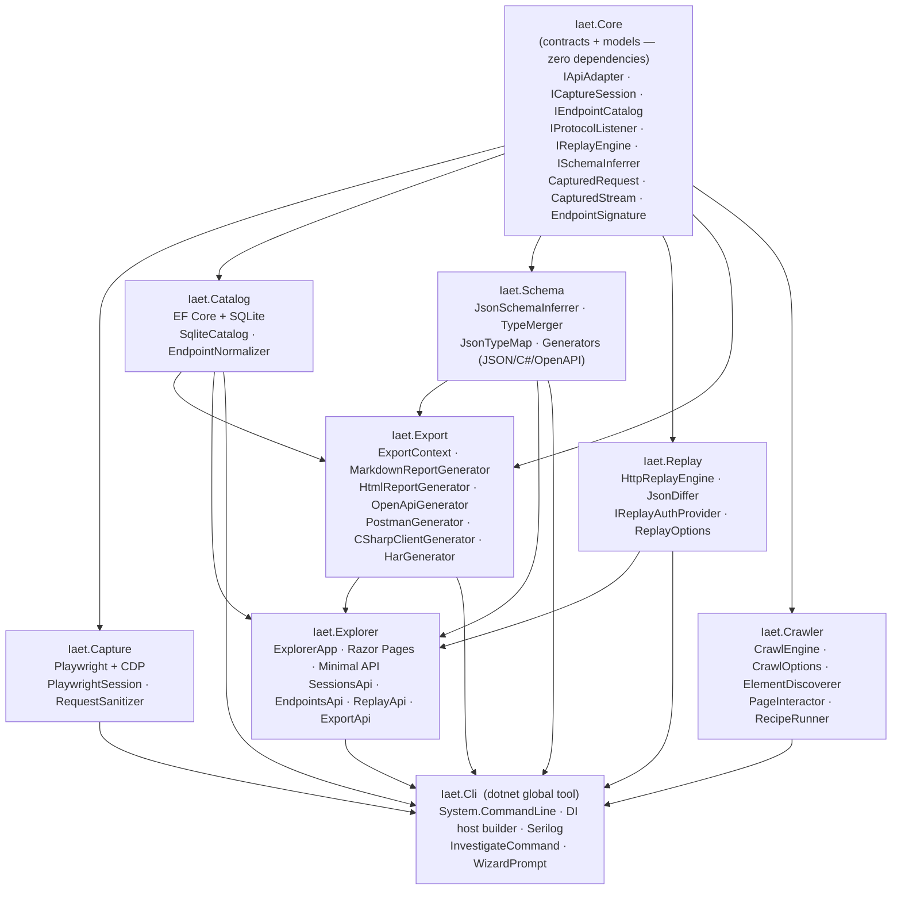

# IAET — Internal API Extraction Toolkit

IAET is a general-purpose toolkit for discovering, capturing, analyzing, and documenting undocumented browser-based internal APIs from any web application. It intercepts HTTP traffic via the Chrome DevTools Protocol while you interact with a target app, normalizes and deduplicates the observed endpoints, and persists them to a local SQLite catalog for downstream analysis. Intended for educational and security research purposes only.

---

## Quick Start

**Install the CLI tool:**
```bash
dotnet tool install -g iaet
```

**Start a capture session:**
```bash
iaet capture start --target "App Name" --url https://example.com --session my-session
```

**Browse captured data:**
```bash
iaet catalog sessions
iaet catalog endpoints --session-id <id>
```

**Infer schemas from response bodies:**
```bash
# Print JSON Schema, C# record, and OpenAPI fragment for an endpoint
iaet schema infer --session-id <guid> --endpoint "GET /api/users"

# Print only one format
iaet schema show --session-id <guid> --endpoint "GET /api/users" --format json
iaet schema show --session-id <guid> --endpoint "GET /api/users" --format csharp
iaet schema show --session-id <guid> --endpoint "GET /api/users" --format openapi
```

**Replay captured requests:**
```bash
# Replay a single request and show diffs vs original response
iaet replay run --request-id <guid>

# Dry-run: show what would be replayed without sending HTTP
iaet replay run --request-id <guid> --dry-run

# Replay one representative request per unique endpoint in a session
iaet replay batch --session-id <guid>
iaet replay batch --session-id <guid> --dry-run
```

**Capture with stream monitoring:**
```bash
# Stream capture is enabled by default
iaet capture start --target "App Name" --url https://example.com --session my-session

# Also capture payload samples (up to 1000 frames per connection)
iaet capture start --target "App Name" --url https://example.com --session my-session \
  --capture-samples --capture-frames 500

# Disable stream capture
iaet capture start --target "App Name" --url https://example.com --session my-session \
  --capture-streams false
```

**Inspect captured streams:**
```bash
# List all streams for a session
iaet streams list --session-id <guid>

# Show full details for a specific stream
iaet streams show --stream-id <guid>

# Show frame history (requires --capture-samples during capture)
iaet streams frames --stream-id <guid>
```

**Run the semi-autonomous crawler:**
```bash
# Crawl a target app (requires a running Playwright browser)
iaet crawl --url https://example.com --target "My App" --session crawl-01

# Limit scope and write a report
iaet crawl --url https://example.com --target "My App" --session crawl-01 \
  --max-depth 2 --max-pages 20 \
  --blacklist "/logout" --blacklist "/admin/*" \
  --exclude-selector ".cookie-banner" \
  --output crawl-report.json
```

**Run a TypeScript Playwright recipe:**
```bash
# Validate and preview the recipe command
iaet capture run --recipe docs/recipes/spotify-playlist-capture.ts --session spotify-01

# Run the recipe directly (npx tsx required)
CDP_ENDPOINT=ws://127.0.0.1:9222 npx tsx docs/recipes/spotify-playlist-capture.ts
```

**Run the guided investigation wizard:**
```bash
# Launch the interactive wizard — walks you through capture → analyze → document
iaet investigate
```

The wizard prompts for a target name and starting URL, lets you choose a capture method, and then loops through a "What next?" menu to view endpoints, infer schemas, and export results.

**Browse the Explorer web UI:**
```bash
# Launch the local web UI (default port 9200)
iaet explore --db catalog.db

# Use a custom port
iaet explore --db catalog.db --port 8080
```

The Explorer serves a Swagger-like interface at `http://localhost:9200` for browsing sessions, endpoints, schemas, streams, replay, and one-click export downloads.

**Export session data:**
```bash
# Markdown investigation report (to stdout)
iaet export report --session-id <guid>

# Self-contained HTML report
iaet export html --session-id <guid> --output report.html

# OpenAPI 3.1 YAML specification
iaet export openapi --session-id <guid> --output api.yaml

# Postman Collection v2.1.0
iaet export postman --session-id <guid> --output collection.json

# Typed C# HTTP client
iaet export csharp --session-id <guid> --output ApiClient.cs

# HAR 1.2 HTTP archive
iaet export har --session-id <guid> --output session.har
```

---

## Features

- Playwright-based browser capture via Chrome DevTools Protocol
- SQLite endpoint catalog with persistent storage
- Automatic endpoint deduplication and observation counting
- Header sanitization (Authorization, Cookie, CSRF tokens redacted)
- Data stream capture — WebSocket, SSE, WebRTC, HLS/DASH, gRPC-Web with frame history
- **Schema inference** — JSON Schema (draft-07), C# records, and OpenAPI 3.1 fragments from captured bodies, with nullable support and type-conflict warnings
- **HTTP replay** — field-level JSON diff, pluggable auth provider, rate limiting (10 req/min / 100 req/day), Polly retry + circuit breaker, dry-run mode
- **Export** — Markdown report, self-contained HTML, OpenAPI 3.1 YAML, Postman Collection v2.1.0, typed C# client, HAR 1.2 — all with credential redaction
- **Semi-autonomous crawler** — BFS page traversal with configurable depth, page count, duration, URL whitelist/blacklist, excluded selectors, and TypeScript recipe execution via `npx tsx`
- **Explorer** — local Swagger-like web UI for browsing sessions, endpoints, schemas, streams, replay, and export — served by `iaet explore --db catalog.db --port 9200`
- **Investigation Wizard** — guided interactive CLI (`iaet investigate`) that walks beginners through capture → analyze → document with numbered menus and auto-generated session names
- Chrome DevTools extension *(coming)*
- Background capture extension *(coming)*

---

## Architecture



---

## CLI Reference

```
iaet
├── capture
│   ├── start  --target <name>  --url <url>  --session <name>
│   │          [--profile <name>]  [--headless]
│   │          [--capture-streams]  [--capture-samples]
│   │          [--capture-duration <seconds>]  [--capture-frames <n>]
│   └── run    --recipe <path>  --session <name>
├── catalog
│   ├── sessions
│   └── endpoints  --session-id <guid>
├── streams
│   ├── list    --session-id <guid>
│   ├── show    --stream-id <guid>
│   └── frames  --stream-id <guid>
├── schema
│   ├── infer  --session-id <guid>  --endpoint <signature>
│   └── show   --session-id <guid>  --endpoint <signature>  --format <json|csharp|openapi>
├── replay
│   ├── run    --request-id <guid>  [--dry-run]
│   └── batch  --session-id <guid>  [--dry-run]
├── export
│   ├── report   --session-id <guid>  [--output <path>]
│   ├── html     --session-id <guid>  [--output <path>]
│   ├── openapi  --session-id <guid>  [--output <path>]
│   ├── postman  --session-id <guid>  [--output <path>]
│   ├── csharp   --session-id <guid>  [--output <path>]
│   └── har      --session-id <guid>  [--output <path>]
├── crawl      --url <url>  [--target <name>]  [--session <name>]
│              [--max-depth <n>]  [--max-pages <n>]  [--max-duration <seconds>]
│              [--headless]  [--blacklist <pattern>]...
│              [--exclude-selector <css>]...  [--output <path>]
│
├── explore    --db <path>  [--port <n>]    (default port: 9200)
├── import     — import .iaet.json capture files
└── investigate — guided interactive wizard: capture → analyze → document
```

---

## Writing Adapters

`IApiAdapter` lets consumer projects attach target-specific logic to the generic capture pipeline. Implement two members:

- `CanHandle(CapturedRequest)` — return `true` if this adapter recognizes the request (e.g., by host or path prefix).
- `Describe(CapturedRequest)` — return an `EndpointDescriptor` enriched with operation name, parameter metadata, or authentication type gleaned from domain knowledge of that target.

Register adapters in DI alongside the core services. The catalog will call `Describe` when a matching adapter is present, storing the richer descriptor alongside the raw request.

---

## Data Stream Support

`CapturedStream` is the domain model for non-HTTP data channels observed during a capture session. Each stream carries a `StreamProtocol` tag and a list of `StreamFrame` records with timestamped payloads.

Supported protocols (Phase 2):

| Protocol | `StreamProtocol` value |
|---|---|
| WebSocket | `WebSocket` |
| Server-Sent Events | `ServerSentEvents` |
| WebRTC data channels | `WebRtc` |
| HLS media segments | `HlsStream` |
| MPEG-DASH segments | `DashStream` |
| gRPC-Web framing | `GrpcWeb` |

Extend capture to new wire formats by implementing `IProtocolListener`:

```csharp
public interface IProtocolListener
{
    string ProtocolName { get; }
    StreamProtocol Protocol { get; }
    bool CanAttach(ICdpSession cdpSession);
    Task AttachAsync(ICdpSession cdpSession, IStreamCatalog catalog, CancellationToken ct);
    Task DetachAsync(CancellationToken ct);
}
```

Register your listener in DI; the capture host discovers and wires it automatically.

---

## Legal & Ethical Guidelines

- **Rate limiting** — introduce deliberate delays between automated actions; never hammer an endpoint.
- **Credential handling** — IAET redacts `Authorization`, `Cookie`, `Set-Cookie`, and CSRF token headers before persisting. Do not disable sanitization.
- **Single-account research** — only use accounts you own or have explicit written permission to test against.
- **No credential publishing** — never commit or share capture databases, session files, or logs that contain authentication material.

Use IAET only on systems you own or have explicit permission to test. Unauthorized access to computer systems is illegal in most jurisdictions.

---

## Development

```bash
# Clone
git clone https://github.com/mmackelprang/IAET.git
cd IAET

# Build
dotnet build Iaet.slnx

# Test
dotnet test Iaet.slnx

# Pack NuGet packages
pwsh scripts/build.ps1 -Target pack
```

Artifacts are written to `artifacts/`.

---

## License

MIT — see [LICENSE](LICENSE).
