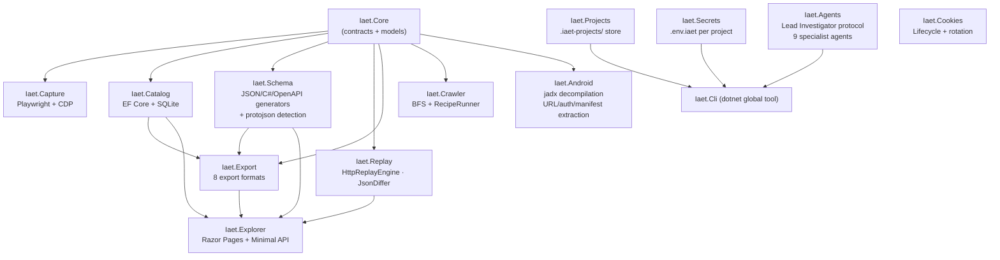

# IAET — Internal API Extraction Toolkit

IAET is a toolkit for discovering, capturing, analyzing, and documenting undocumented APIs from web applications and Android APKs. It intercepts HTTP traffic via the Chrome DevTools Protocol or a browser extension while you interact with a target, normalizes and deduplicates observed endpoints, and persists them to a local SQLite catalog for downstream analysis.

Intended for educational and security research purposes only.

---

## Quick Start

**Install:**
```bash
dotnet tool install -g iaet
```

**Web application investigation (browser extension):**
```bash
# 1. Create a project
iaet project create --name my-target --url https://example.com --auth-required

# 2. Load the browser extension: extensions/iaet-capture/dist in Chrome
# 3. Browse the target, click Stop, Export → saves capture.iaet.json

# 4. Import the capture
iaet import --file capture.iaet.json --project my-target

# 5. Generate outputs
iaet export openapi  --session-id <guid> --output api.yaml
iaet export narrative --session-id <guid> --output narrative.md
iaet dashboard --project my-target
```

**Android APK investigation:**
```bash
iaet project create --name my-app --url https://api.example.com --target-type android
iaet apk decompile --project my-app --apk path/to/app.apk
iaet apk analyze   --project my-app
iaet dashboard     --project my-app
```

**Agent-driven investigation:**
```bash
iaet investigate --project my-target
# Then tell Claude Code: "Investigate the project my-target following the Lead Investigator protocol"
```

See **[docs/user-guide.md](docs/user-guide.md)** for comprehensive step-by-step instructions covering all workflows.

---

## Features

- **Browser extension** — captures HTTP (fetch/XHR), WebSocket (with binary frame decoding), WebRTC (SDP/ICE), and SSE from any Chrome tab without a proxy
- **Playwright-based capture** — CDP session recording with stream monitoring (WebSocket, SSE, WebRTC, HLS, DASH, gRPC-Web)
- **Android APK analysis** — jadx-based decompilation, endpoint extraction, auth pattern detection, manifest permissions, network security config (cert pinning)
- **Agent investigation system** — orchestrated multi-round investigation using a team of specialist Claude Code agents (Lead Investigator, Network Capture, JS Analyzer, Protocol Analyzer, Schema Analyzer, Crawler, Cookie & Session, Diagram Generator, Report Assembler)
- **SQLite endpoint catalog** — persistent storage with automatic deduplication and observation counting
- **Schema inference** — JSON Schema (draft-07), C# records, and OpenAPI 3.1 fragments; detects protojson (positional JSON arrays)
- **HTTP replay** — field-level JSON diff, pluggable auth provider, rate limiting, Polly retry + circuit breaker, dry-run mode
- **Export** — Markdown report, self-contained HTML, OpenAPI 3.1 YAML, Postman Collection v2.1.0, typed C# HTTP client, HAR 1.2, investigation narrative, AI client-generation prompt
- **Dashboard** — HTML multi-project overview with OpenAPI Swagger UI and next-steps recommendations
- **Compressed capture archival** — `iaet import --project` stores captures as `.iaet.json.gz` in the project directory
- **Secrets management** — per-project `.env.iaet` file; never committed to git
- **Semi-autonomous crawler** — BFS page traversal with configurable depth, blacklists, and TypeScript recipe execution
- **Explorer** — local Swagger-like web UI for browsing sessions, endpoints, schemas, streams, replay, and export
- **Cookie analysis** — lifecycle tracking, rotation detection, expiry warnings across snapshots

---

## CLI Reference

```
iaet
├── project
│   ├── create  --name <slug>  --url <url>
│   │           [--target-type web|android|desktop]  [--auth-required]
│   │           [--display-name <name>]
│   ├── list
│   ├── status  --name <name>
│   └── archive --name <name>
│
├── capture
│   ├── start  --target <name>  --url <url>  --session <name>
│   │          [--profile <name>]  [--headless]
│   │          [--capture-streams]  [--capture-samples]
│   │          [--capture-duration <seconds>]  [--capture-frames <n>]
│   └── run    --recipe <path>  --session <name>
│
├── import     --file <path.iaet.json>  [--project <name>]
│             |--listen  [--port <n>]   (default port: 7474)
│
├── catalog
│   ├── sessions
│   └── endpoints  --session-id <guid>
│
├── streams
│   ├── list    --session-id <guid>
│   ├── show    --stream-id <guid>
│   └── frames  --stream-id <guid>
│
├── schema
│   ├── infer  --session-id <guid>  --endpoint <signature>
│   └── show   --session-id <guid>  --endpoint <signature>
│              --format <json|csharp|openapi>
│
├── replay
│   ├── run    --request-id <guid>  [--dry-run]
│   └── batch  --session-id <guid>  [--dry-run]
│
├── export
│   ├── report         --session-id <guid>  [--output <path>]
│   ├── html           --session-id <guid>  [--output <path>]
│   ├── openapi        --session-id <guid>  [--output <path>]
│   ├── postman        --session-id <guid>  [--output <path>]
│   ├── csharp         --session-id <guid>  [--output <path>]
│   ├── har            --session-id <guid>  [--output <path>]
│   ├── narrative      --session-id <guid>  [--output <path>]
│   └── client-prompt  --session-id <guid>  [--output <path>]
│
├── crawl      --url <url>  [--target <name>]  [--session <name>]
│              [--max-depth <n>]  [--max-pages <n>]  [--max-duration <seconds>]
│              [--headless]  [--blacklist <pattern>]...
│              [--exclude-selector <css>]...  [--output <path>]
│
├── apk
│   ├── decompile  --project <name>  --apk <path>
│   │              [--jadx-path <path>]  [--mapping <mapping.txt>]
│   └── analyze    --project <name>
│
├── cookies
│   ├── snapshot  --project <name>
│   ├── diff      --project <name>  --before <guid>  --after <guid>
│   └── analyze   --project <name>
│
├── secrets
│   ├── set    --project <name>  --key <key>  --value <value>
│   ├── get    --project <name>  --key <key>
│   ├── list   --project <name>
│   └── audit  --project <name>
│
├── round
│   └── status  --project <name>
│
├── dashboard  [--project <name>]  [--open]
├── explore    --db <path>  [--port <n>]
└── investigate [--project <name>]
```

---

## Architecture



---

## Legal & Ethical Guidelines

- **Rate limiting** — introduce deliberate delays between automated actions.
- **Credential handling** — IAET redacts `Authorization`, `Cookie`, `Set-Cookie`, and CSRF token headers before persisting. Do not disable sanitization.
- **Single-account research** — only use accounts you own or have explicit written permission to test.
- **No credential publishing** — never commit capture databases, session files, `.env.iaet`, or logs that contain authentication material.

Use IAET only on systems you own or have explicit permission to test. Unauthorized access to computer systems is illegal in most jurisdictions.

---

## Development

```bash
git clone https://github.com/mmackelprang/IAET.git
cd IAET

dotnet build Iaet.slnx
dotnet test  Iaet.slnx

# Pack NuGet packages
pwsh scripts/build.ps1 -Target pack
```

Artifacts are written to `artifacts/`.

---

## License

MIT — see [LICENSE](LICENSE).
