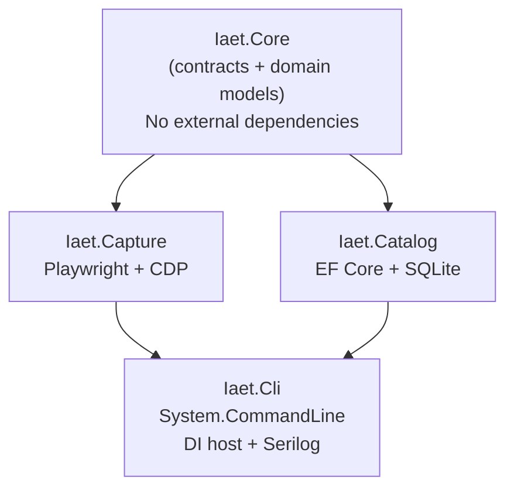
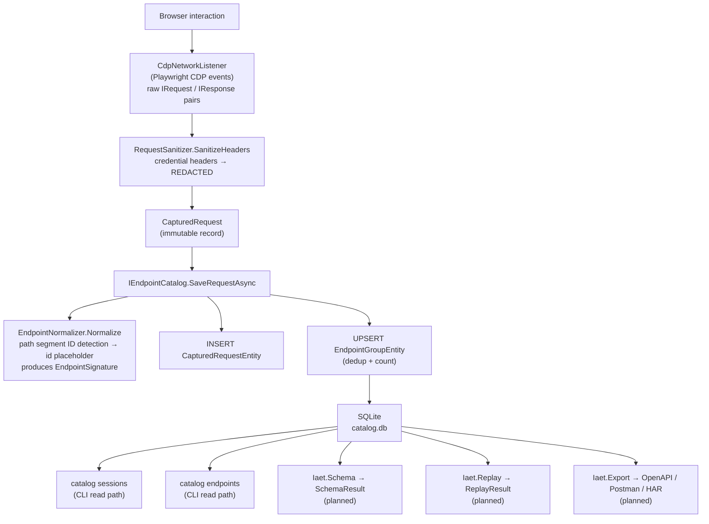

# IAET Architecture

## Assembly Dependency Diagram

**Planned assemblies** (all depend on `Iaet.Core`):

- `Iaet.Schema` — schema inference from CapturedRequest bodies
- `Iaet.Replay` — HTTP replay; depends on `Iaet.Catalog`
- `Iaet.Crawler` — semi-autonomous browser crawler; depends on `Iaet.Capture`
- `Iaet.Export` — OpenAPI/Postman/HAR generation; depends on `Iaet.Catalog`
- `Iaet.Explorer` — local web UI; depends on `Iaet.Catalog` + `Iaet.Schema`

## Data Flow

## Design Decisions

### Dependency inversion via Iaet.Core
All concrete assemblies depend on `Iaet.Core`, never on each other. This keeps `Iaet.Capture` and `Iaet.Catalog` independently testable and swappable. The CLI is the only composition root.

### EF Core over raw SQLite
EF Core was chosen for migration management and LINQ query composition. The tradeoff is a larger binary; the benefit is that schema evolution (adding columns, indexes) is tracked in source-controlled migration files with zero manual SQL.

### Deduplication at write time
`EndpointGroup` rows are upserted every time a request is saved rather than computed on read. This keeps `GetEndpointGroupsAsync` O(1) per group and avoids full-table scans on large sessions.

### System.CommandLine (preview)
The CLI uses the `System.CommandLine` library for structured argument parsing, typed options, and built-in `--help` generation. The `System.CommandLine.Hosting` integration is not used; instead the DI host is built once in `Program.cs` and passed into each command factory, which keeps the host lifetime aligned with the process rather than the command.

### Header sanitization as a hard invariant
`RequestSanitizer` is not configurable. Any future opt-in mechanism would require an explicit allowlist, not a blocklist, to prevent accidental credential exposure in shared capture databases.

### Playwright for capture
Playwright (Chromium via CDP) was chosen over raw proxy interception because it can capture traffic from single-page applications that make XHR/fetch calls inside complex authentication flows without requiring SSL certificate trust overrides on the host machine.
