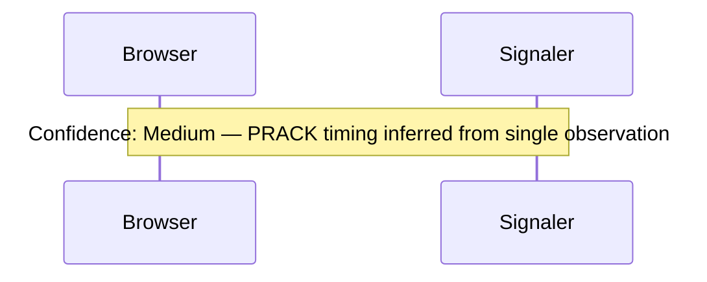

# IAET Agent Investigation Team — Design Specification

**Date:** 2026-03-31
**Status:** Draft
**Author:** Mark + Claude

## Overview

An autonomous agent team that investigates websites, phone apps, and desktop applications to discover and document their back-end services, data flows, streaming protocols, and undocumented APIs. Built on the existing IAET toolkit, adding project-scoped isolation, iterative multi-round investigation, cookie/session lifecycle analysis, JavaScript bundle analysis, protocol-aware stream analysis, and automated diagram generation.

### Primary Use Case

Developers wanting to build against undocumented APIs they've observed — reverse engineering for integration purposes. Secondary use cases: security research (auth flow mapping), compliance auditing (data flow tracing), and competitive intelligence (service topology discovery).

### Design Principles

- **Iterative discovery** — investigations proceed in rounds; later analysis reveals new capture targets
- **Human-in-the-loop** — auth bootstrap, manual interactions, and "go deeper" decisions involve the human
- **Credential safety** — secrets never enter git, the catalog, investigation logs, or any export output
- **Confidence transparency** — all findings annotated with observation count, source, and limitations
- **Project isolation** — each investigation is fully self-contained and archivable

---

## Agent Team Architecture

### Topology: Hybrid Orchestrator + Pipeline Stages

A **Lead Investigator** agent orchestrates iterative rounds. Each round runs parallel capture agents, then parallel analysis agents. The Lead reviews results after each round and decides whether to dispatch another round with refined targets or finalize into documentation.

```
Lead Investigator (Orchestrator)
  │
  ├── Round N: Capture Stage (parallel)
  │   ├── Network Capture Agent
  │   ├── Cookie & Session Agent
  │   └── Crawler Agent
  │
  ├── Round N: Analysis Stage (parallel)
  │   ├── JS Bundle Analyzer
  │   ├── Protocol Analyzer
  │   └── Schema & Dependency Analyzer
  │
  └── Finalize: Documentation Stage
      ├── Diagram Generator
      └── Report Assembler
```

### Cross-Cutting Concerns

- **Secrets Manager** — project-scoped `.env.iaet`, gitignored, pre-commit hook guard
- **Project Store** — `.iaet-projects/{name}/` with round state, knowledge base, outputs
- **Auth Bootstrap** — human-in-the-loop login, cookie/token extraction, session monitoring

---

## Project Model

### Directory Structure

```
.iaet-projects/
├── google-voice/
│   ├── .env.iaet              # secrets (gitignored)
│   ├── project.json           # metadata, target info, phase config
│   ├── investigation.log      # append-only log of all agent actions
│   ├── catalog.db             # project-scoped SQLite
│   ├── rounds/
│   │   ├── 001-initial-capture/
│   │   │   ├── plan.json      # what Lead dispatched
│   │   │   ├── findings.json  # merged results from all agents
│   │   │   └── sessions/      # .iaet.json capture files
│   │   ├── 002-js-deep-dive/
│   │   │   ├── plan.json
│   │   │   ├── findings.json
│   │   │   └── bundles/       # downloaded JS for analysis
│   │   └── 003-streaming-analysis/
│   │       ├── plan.json
│   │       └── findings.json
│   ├── output/
│   │   ├── api.yaml           # OpenAPI spec
│   │   ├── collection.json    # Postman
│   │   ├── client.cs          # C# client
│   │   ├── report.html        # investigation report
│   │   └── diagrams/
│   │       ├── call-signaling.mmd
│   │       ├── data-flow.mmd
│   │       ├── auth-chain.mmd
│   │       └── webrtc-states.mmd
│   └── knowledge/
│       ├── endpoints.json     # discovered API surface
│       ├── cookies.json       # cookie inventory + lifecycle
│       ├── protocols.json     # stream protocol catalog
│       ├── dependencies.json  # call ordering / auth chains
│       └── human-actions.json # items needing human review
```

### project.json Schema

```json
{
  "name": "google-voice",
  "displayName": "Google Voice Investigation",
  "targetType": "web",
  "entryPoints": [
    { "url": "https://voice.google.com", "label": "Main app" }
  ],
  "authRequired": true,
  "authMethod": "browser-login",
  "focusAreas": ["call-signaling", "sms-api", "streaming-protocols"],
  "crawlConfig": {
    "maxDepth": 3,
    "maxPages": 50,
    "blacklist": ["/logout", "/delete*"],
    "excludeSelectors": [".cookie-banner"]
  },
  "currentRound": 3,
  "status": "investigating",
  "createdAt": "2026-03-26T10:00:00Z",
  "lastActivityAt": "2026-03-31T14:00:00Z"
}
```

### Key Design Decisions

- **Project-scoped catalog.db** — each project gets its own SQLite database, reusing the existing IAET schema. Projects are fully self-contained and can be archived, shared, or deleted as a single unit.
- **Round-based state** — numbered round directories with plan (dispatch) and findings (results) provide a clear audit trail. The Lead references previous rounds when planning the next one.
- **Knowledge base as agent memory** — `knowledge/` contains structured JSON that agents accumulate across rounds. The Lead reads this as context before each round.
- **Secrets isolation** — `.env.iaet` is always gitignored. `investigation.log` records that secrets were used but never their values. All exports run through credential redaction.

---

## Investigation Lifecycle

### Step 1: Project Init

- Create `.iaet-projects/{name}/`
- Write `project.json` with targets and config
- Initialize empty `catalog.db`
- Create `knowledge/` skeleton
- Lead assesses target: SPA? Auth required? Streaming?

### Step 2: Auth Bootstrap (Human-in-the-Loop)

- Lead detects auth requirement from `project.json`
- **PAUSE** — asks human to log in via browser
- Agent captures cookies/tokens post-login via CDP `Network.getAllCookies`
- Stores values to `.env.iaet` (never in catalog or logs)
- Validates session works before proceeding
- Monitors for expiry throughout investigation

### Step 3: Investigation Rounds (Loop)

Each round has three phases:

**A. Lead Plans the Round**

The Lead writes `rounds/{N}/plan.json` specifying:
- Which agents to dispatch
- What targets each agent should investigate
- What human actions are needed
- Rationale for this round (what knowledge gaps it addresses)

**B. Agents Execute in Parallel**

Capture-stage agents run in parallel, followed by analysis-stage agents in parallel. Agents that need human interaction (e.g., "place a phone call now") pause and wait.

**C. Lead Synthesizes Results**

- Merge findings from all agents, deduplicate
- Update `knowledge/` directory
- Evaluate termination criteria
- Either plan another round or proceed to finalize

### Step 4: Review / Decision

The Lead presents a coverage summary and recommends next action:
- Another round (with rationale)
- Finalize and export
- Human decides

### Step 5: Finalize

- Diagram Generator produces all diagram types
- Report Assembler generates all export formats
- Human action items list compiled
- Secrets audit generated
- Coverage report with confidence levels

### Round Termination Criteria

| Type | Condition |
|------|-----------|
| Auto-stop | No new endpoints discovered in last round |
| Auto-stop | All JS-bundle-discovered URLs confirmed or marked unreachable |
| Auto-stop | Max rounds reached (configurable, default 5) |
| Human decides | Lead presents coverage summary, human says "enough" or "continue" |
| Human decides | Auth expired and human chooses not to re-authenticate |
| Force stop | Rate limit hit on target (429s or blocks detected) |
| Force stop | Target becomes unreachable |

---

## Agent Specifications

### Lead Investigator

**Role:** Orchestrator — the only agent that communicates with the human.

**Responsibilities:**
- Create and manage `project.json`
- Assess target type (SPA, MPA, auth method)
- Plan each round based on knowledge gaps
- Dispatch specialist agents with specific targets
- Merge findings, deduplicate across agents
- Maintain `knowledge/` directory
- Decide: another round or finalize
- Request human actions (login, interactions)
- Monitor auth/session health
- Trigger final documentation stage

**Decision Framework:**
```
IF new_endpoints_found > 0 AND round_count < max_rounds AND auth_valid
  THEN plan another round

IF js_analysis.unobserved_urls > 0
  THEN dispatch capture for those URLs

IF stream_protocols.incomplete > 0
  THEN dispatch deeper protocol analysis

IF cookie_expiry < 10min
  THEN pause and request re-auth

IF coverage_confidence > threshold
  THEN present summary, ask human
```

**Implementation:** Claude Code sub-agent with tool access to the IAET CLI and project filesystem. The Lead spawns specialist agents as Claude Code sub-agents via the Agent tool, each with a focused system prompt and access to the relevant IAET CLI commands. All agents in the team are Claude Code sub-agents — the Lead dispatches them in parallel within each round stage and collects their results. The `iaet investigate` CLI command sets up the project context and then hands off to the Lead agent.

### Network Capture Agent

**Extends:** `Iaet.Capture`

**Tools:** `iaet capture start`, Playwright browser automation, CDP Network domain, all `IProtocolListener` implementations, `iaet streams list/show`

**New capabilities:**
- Targeted URL list capture (from Lead's plan)
- Action-triggered capture ("click element X, record all traffic for 5s")
- Stream-aware: tags streams by trigger context
- Retry on transient failures
- Reports `needs_human_action` items

**Output:** `.iaet.json` capture files, stream artifacts, endpoint list with first-seen context, triggered-by annotations, auth health status

### Cookie & Session Agent

**New component** — implements the cookie scope document (`docs/api-research/iaet-cookie-scope.md`)

**Tools:** CDP `Network.getAllCookies`, CDP `Network.setCookie` (for testing), CDP `Storage.getCookies`, Playwright page context, `localStorage`/`sessionStorage` read

**Capabilities:**
- Full cookie enumeration with metadata (domain, path, expiry, httpOnly, secure, sameSite)
- Snapshot before/after each navigation event
- Auth-critical cookie identification (by replay testing with/without each cookie)
- Rotation pattern detection (polling across time)
- Expiry timeline and refresh mechanism analysis
- `localStorage`/`sessionStorage` token scan

**Output:** `knowledge/cookies.json` inventory, auth-critical cookie list, rotation timeline, expiry warnings, storage token catalog. Cookie values stored ONLY in `.env.iaet`.

### Crawler Agent

**Extends:** `Iaet.Crawler`

**Tools:** `iaet crawl`, `CrawlEngine`, `ElementDiscoverer`, `PlaywrightPageNavigator`, `PageInteractor`

**New capabilities:**
- Lead-directed crawl targets (selective rather than exhaustive)
- Selective interaction ("click Settings, not Logout")
- SPA route enumeration via JS router detection (React Router, Vue Router, Angular Router)
- Coverage tracking against known endpoints
- Hidden element discovery (`data-*` attributes, `aria` roles)

**Output:** `crawl-report.json`, page-to-endpoint map, navigation graph, interactive element inventory, route/view catalog

### JS Bundle Analyzer

**New component**

**Tools:** HTTP download of JS bundles, AST parser (Acorn via Node.js interop), regex pattern matching, source map loader (when `.map` files available), beautifier (js-beautify)

**Extraction targets:**
- URL string literals (`/api/v1/...`)
- `fetch()` / `XMLHttpRequest` call sites with method + URL
- GraphQL query strings and mutations
- Protobuf message definitions
- Route table / path configs
- Config objects and feature flags
- SDK client instantiations
- WebSocket URL constructions (`new WebSocket(url)`)
- `new RTCPeerConnection` configs

**Output:** Discovered URL patterns with source location, confirmed vs unobserved endpoint list, extracted data structures, "go deeper" flags with guidance (e.g., "Obfuscated module at line 4521 appears to construct WebSocket URLs dynamically — consider runtime instrumentation")

**Implementation:** .NET host process spawns Node.js for AST parsing (Acorn). Results returned as JSON, consumed by .NET agent. Regex-based fallback for simple URL pattern matching.

### Protocol Analyzer

**New component**

**Protocols handled:**
- **WebSocket** — message type classification, sub-protocol detection (graphql-ws, SIP, custom binary)
- **WebRTC** — SDP offer/answer parsing, ICE candidate analysis, codec negotiation, DTLS/SRTP params
- **SSE** — event type catalog, reconnection patterns
- **gRPC-Web** — service/method extraction, proto message structure inference
- **HLS/DASH** — manifest parsing, variant stream analysis, DRM detection

**Capabilities:**
- Message classification (control vs data)
- State machine reconstruction from observed transitions
- Request/response correlation within streams
- Binary frame decoding heuristics (length-prefixed, protobuf, msgpack)
- Heartbeat/keepalive detection
- Session lifecycle mapping
- Media stream parameter extraction
- Bandwidth/quality tier enumeration

**Output:** `knowledge/protocols.json`, message type catalog per stream, state machine definitions (Mermaid), decoded frame samples, protocol documentation fragments, confidence levels, limitation notes

**Contract:** Pluggable `IStreamAnalyzer` interface — `Analyze(CapturedStream) → StreamAnalysis`

### Schema & Dependency Analyzer

**Extends:** `Iaet.Schema`

**Tools:** `iaet schema infer`, `JsonSchemaInferrer`, `TypeMerger`, `iaet replay run --dry-run`, cookie inventory from Cookie Agent

**New capabilities:**
- Request dependency ordering ("GET /session must precede GET /calls because X-Session-Id header required")
- Auth chain detection (cookie → token → API call relationships)
- Shared ID tracing across endpoints (IDs that appear in one response and another request)
- Rate limit detection (429 patterns, Retry-After headers)
- Error response classification

**Fixes to existing code:**
- `JsonTypeMap` — handle non-JSON bodies (JSONP, BOM, XSS-prefix, HTML) without crashing
- `JsonDiffer` — same non-JSON robustness
- Content-type pre-filter before `JsonDocument.Parse`
- Graceful degradation: "body is not JSON, skipping schema inference"

**Output:** Enriched `knowledge/endpoints.json`, `knowledge/dependencies.json`, JSON Schema per endpoint, auth chain graph, rate limit annotations, error taxonomy

### Diagram Generator

**New component**

**Diagram types:**

1. **Sequence Diagrams** — API call flows reconstructed from captured traffic. Shows actor → service → response chains with timing.
2. **Data Flow Maps** — directed graph of services, what data moves between them, what auth is required at each hop.
3. **Protocol State Machines** — for streaming protocols (WebRTC, SIP, WebSocket sub-protocols). States and transitions from Protocol Analyzer output.
4. **Dependency Graphs** — which API calls must precede others. Auth flows, session bootstrapping, resource dependencies.

**Output format:** Mermaid `.mmd` files, renderable in GitHub, VS Code, and HTML reports. Each diagram includes confidence annotations as Mermaid notes ("Inferred from 3 observations — high confidence" or "Reconstructed from JS bundle — needs verification").

### Report Assembler

**Extends:** `Iaet.Export`

**Existing exports (enhanced):**
- OpenAPI 3.1 YAML (now includes stream/WebSocket endpoint documentation)
- Postman Collection v2.1
- HAR 1.2 archive
- Typed C# client
- Markdown report (now includes Mermaid code blocks)
- HTML report (now embeds rendered Mermaid diagrams)

**New exports:**
- **Investigation narrative** — round-by-round story of what was found and how
- **Coverage report** — known endpoints vs observed, confidence levels per endpoint
- **Human action items** — what still needs manual investigation, with context
- **Secrets audit** — which secrets were used (not values), which are expiring

**Credential guard:** All exports pass through `HeaderRedactor` + new `SecretsRedactor` that cross-references `.env.iaet` values and scrubs any that appear in output bodies, URLs, or diagrams.

---

## Agent Communication

### Lead → Agents: plan.json

```json
{
  "roundNumber": 2,
  "rationale": "Round 1 found 12 REST endpoints but JS bundle references 40+ URL patterns.",
  "dispatches": [
    { "agent": "js-bundle-analyzer", "targets": ["https://voice.google.com/main-bundle.js"] },
    { "agent": "protocol-analyzer", "targets": ["stream:ws-sip-channel"] },
    { "agent": "network-capture", "targets": ["https://voice.google.com/calls"], "actions": ["initiate-call"] }
  ],
  "humanActions": [
    { "action": "Place a phone call during capture window", "reason": "Need to observe call setup signaling" }
  ]
}
```

### Agents → Lead: findings.json

Structured results with:
- Discovered endpoints (new + confirmed)
- Captured streams with protocol tags
- Inferred schemas
- Confidence levels (high/medium/low with reasoning)
- "Go deeper" flags with guidance for the Lead

### Agents → Human: human-actions.json

- Login/re-auth requests
- Manual interaction requests (place a call, send SMS)
- Approval gates
- "Needs your judgment" items
- Re-auth prompts with urgency level

---

## New Components to Build

### Phase 1: Foundation

| Component | Type | Purpose |
|-----------|------|---------|
| `Iaet.Projects` | New assembly | Project lifecycle (create, list, load, archive), round management, knowledge store |
| `Iaet.Agents` | New assembly | Agent framework: `IInvestigationAgent` contract, `LeadInvestigator`, `RoundExecutor`, `HumanInteractionBroker`, `FindingsMerger` |
| `Iaet.Secrets` | New assembly | Project-scoped `.env.iaet` read/write, `SecretsRedactor`, `GitGuard` (gitignore + pre-commit hook) |
| `Iaet.Cli` | Extend | New commands: `project create/list/status/archive`, `round run/status`, `secrets set/get/list/audit`, enhanced `investigate --project` |

### Phase 2: Capture Enhancements

| Component | Type | Purpose |
|-----------|------|---------|
| `Iaet.Cookies` | New assembly | CDP cookie collection, `CookieSnapshot`, `CookieDiffer`, `CookieLifecycleAnalyzer`, `AuthCookieIdentifier`, `StorageScanner` |
| `Iaet.Capture` | Extend | `ActionTriggeredCapture`, `TargetedUrlCapture`, `CaptureContextAnnotator`, `AuthHealthMonitor`, WebRTC listener graceful fallback |
| `Iaet.Crawler` | Extend | Wire `PlaywrightPageNavigator` into CLI, agent-directed selective crawling, SPA route detection, coverage tracking |
| `Iaet.Cli` | Extend | New commands: `cookies snapshot/diff/analyze` |

### Phase 3: Analysis

| Component | Type | Purpose |
|-----------|------|---------|
| `Iaet.JsAnalysis` | New assembly | `BundleDownloader`, `BundleParser` (Acorn via Node.js), `UrlExtractor`, `FetchCallExtractor`, `GraphQlExtractor`, `ConfigExtractor`, `WebSocketUrlExtractor`, `ProtobufExtractor` |
| `Iaet.ProtocolAnalysis` | New assembly | `IStreamAnalyzer` contract, `WebSocketAnalyzer`, `SipAnalyzer`, `SdpParser`, `WebRtcSessionReconstructor`, `GrpcServiceExtractor`, `MediaManifestAnalyzer`, `StateMachineBuilder`, `BinaryFrameHeuristics` |
| `Iaet.Schema` | Extend | `DependencyGraphBuilder`, `AuthChainDetector`, `SharedIdTracer`, `RateLimitDetector`, `ErrorClassifier`, non-JSON body robustness fix |

### Phase 4: Documentation & Diagrams

| Component | Type | Purpose |
|-----------|------|---------|
| `Iaet.Diagrams` | New assembly | `SequenceDiagramGenerator`, `DataFlowMapGenerator`, `StateMachineDiagramGenerator`, `DependencyGraphDiagramGenerator`, `ConfidenceAnnotator` |
| `Iaet.Export` | Extend | `InvestigationNarrativeGenerator`, `CoverageReportGenerator`, `HumanActionItemsGenerator`, `SecretsAuditGenerator`, embedded Mermaid in HTML, `SecretsRedactor` integration |
| `Iaet.Explorer` | Extend | Project dashboard, project detail view with tabs, diagram viewer with Mermaid rendering, auth status panel |

### Future Phases (Not in Scope)

**Phase 5: Android (APK)**
- `Iaet.Android` — jadx/apktool integration, Smali/Java → API extraction, network security config analysis, certificate pinning detection, Frida script generation, mitmproxy integration

**Phase 6: Desktop (EXE/DLL)**
- `Iaet.Desktop` — ILSpy/dnSpy .NET decompilation, PE import table analysis, API Monitor integration, HTTP client class extraction from .NET assemblies, WinHTTP/WinInet hooks, Fiddler/mitmproxy integration

---

## Explorer Integration

### Project Dashboard

The Explorer web UI gains a new **Projects** tab showing all projects with:
- Status badges (new / investigating / complete)
- Stats (endpoint count, stream count, cookie count, coverage %)
- Tags (target type, auth-required, streaming)
- Last activity timestamp

### Project Detail View

Tabs: Overview, Rounds, Endpoints, Streams, Cookies, Diagrams, Exports, Action Items

**Overview tab:**
- Stats row (endpoints, streams, cookies, coverage %)
- Investigation timeline (round-by-round with findings summary)
- Action items panel with urgency indicators
- Auth status with expiry warning and re-authenticate button
- Quick export buttons

### Diagram Viewer

- Sidebar listing all generated diagrams
- Rendered Mermaid preview (client-side Mermaid.js)
- Export to SVG/PNG and view source (.mmd)
- Confidence annotations displayed below each diagram

---

## CLI Interaction Model

### New Commands

```
iaet project create --name <name> --url <url> --target-type <web|android|desktop>
                    [--auth-required] [--focus-areas <area>...]
iaet project list
iaet project status --name <name>
iaet project archive --name <name>

iaet investigate --project <name>    # enhanced wizard with agent orchestration

iaet round run --project <name>      # run a single round
iaet round status --project <name>   # show current round progress

iaet secrets set --project <name> --key <key> --value <value>
iaet secrets get --project <name> --key <key>
iaet secrets list --project <name>
iaet secrets audit --project <name>

iaet cookies snapshot --project <name>
iaet cookies diff --project <name> --before <id> --after <id>
iaet cookies analyze --project <name>
```

### Enhanced Existing Commands

- `iaet capture start` gains `--project` flag (stores in project catalog)
- `iaet export` gains `--project` flag (outputs to project output directory)
- `iaet explore` gains project browser in the web UI

### Interactive Investigation Flow

```
$ iaet investigate --project google-voice
[Lead] Auth required. Opening browser for login...
[Lead] Please log in to Google Voice. Press Enter when done.
  > [user presses Enter]
[Lead] Captured 38 cookies. Session valid (expires in 1h).
[Lead] Starting Round 1: Initial capture + crawl + cookie analysis
  [Network]  12 endpoints found
  [Crawler]  8 pages, 23 interactive elements
  [Cookies]  38 cookies, 3 auth-critical
[Lead] Round 1 complete. JS bundle references ~40 unobserved URLs.
[Lead] Recommend Round 2: JS analysis + targeted capture. Proceed? [Y/n/skip]
```

---

## Secrets Management

### Invariants

1. Secret values NEVER written to `catalog.db`
2. Secret values NEVER in `investigation.log` (only "secret X was used")
3. Secret values NEVER in any export output (HTML, OpenAPI, Postman, etc.)
4. `.env.iaet` always gitignored
5. Pre-commit hook scans staged files for patterns matching known secret values
6. `SecretsRedactor` cross-references `.env.iaet` values against all output strings

### .env.iaet Format

```env
# Google Voice Investigation Secrets
# Auto-generated by IAET Cookie Agent — do not commit
GV_SESSION_COOKIE=<value>
GV_AUTH_TOKEN=<value>
GV_CSRF_TOKEN=<value>
```

### Future: Encrypted Vault

The `.env.iaet` approach is intentionally simple for v1. A future enhancement can add an encrypted vault with a master passphrase, but the invariants above remain unchanged regardless of storage backend.

---

## Confidence & Limitation Annotations

All findings carry confidence metadata:

```json
{
  "endpoint": "POST /v1/voiceclient/api2/send_sms",
  "confidence": "high",
  "observationCount": 5,
  "sources": ["network-capture-round-1", "network-capture-round-3"],
  "limitations": []
}
```

```json
{
  "endpoint": "GET /v1/voiceclient/api2/admin/settings",
  "confidence": "low",
  "observationCount": 0,
  "sources": ["js-bundle-analyzer-round-2"],
  "limitations": ["Extracted from JS bundle string literal only — never observed in traffic. May require admin role."]
}
```

Diagrams include confidence as Mermaid notes:


---

## Dependency Map

```
Iaet.Core (existing, unchanged)
    │
    ├── Iaet.Projects (new)
    │       │
    │       ├── Iaet.Agents (new) ── depends on Iaet.Projects
    │       └── Iaet.Secrets (new) ── depends on Iaet.Projects
    │
    ├── Iaet.Cookies (new) ── depends on Iaet.Capture
    │
    ├── Iaet.JsAnalysis (new) ── depends on Node.js (Acorn)
    │
    ├── Iaet.ProtocolAnalysis (new) ── depends on Iaet.Capture
    │
    ├── Iaet.Diagrams (new)
    │
    ├── Iaet.Capture (extend)
    ├── Iaet.Catalog (existing, unchanged)
    ├── Iaet.Schema (extend)
    ├── Iaet.Replay (existing, unchanged)
    ├── Iaet.Export (extend) ── depends on Iaet.Diagrams
    ├── Iaet.Crawler (extend)
    ├── Iaet.Explorer (extend)
    └── Iaet.Cli (extend)
```

---

## Implementation Phases

**Phase 1: Foundation** — `Iaet.Projects`, `Iaet.Agents`, `Iaet.Secrets`, CLI commands
**Phase 2: Capture** — `Iaet.Cookies`, `Iaet.Capture` extensions, `Iaet.Crawler` wiring
**Phase 3: Analysis** — `Iaet.JsAnalysis`, `Iaet.ProtocolAnalysis`, `Iaet.Schema` extensions
**Phase 4: Documentation** — `Iaet.Diagrams`, `Iaet.Export` extensions, Explorer enhancements
**Phase 5: Android** — `Iaet.Android` (future, not in scope)
**Phase 6: Desktop** — `Iaet.Desktop` (future, not in scope)

Each phase builds on the previous. Phase 1 must complete before any other phase can start. Phases 2 and 3 can partially overlap (cookie capture informs schema analysis). Phase 4 depends on phases 2 and 3.
